# AXTP C++ Runtime

This repository contains the AXTP C++ runtime, SDK, optional transports, and
developer tooling. Protocol facts are generated from the locked AXTP spec; this
repository implements those facts for C++.

## Architecture

The repository is layered so application code can enter at the highest useful
level and avoid depending on lower-level wire details unless it needs them.

```mermaid
flowchart LR
    Spec["AXTP spec repo\nlocked by AXTP_SPEC.lock.yaml"] --> Generators["devtools/generators/\nTypeScript emitter"]
    Generators --> Generated["include/core/protocol/generated/\nIDs, registries, schemas"]

    Support["include/core/support/io"] --> Protocol["include/core/protocol/model\ninclude/core/protocol/generated"]
    Generated --> Protocol
    Protocol --> Wire["include/core/protocol/wire\ninclude/core/protocol/session"]
    Wire --> Runtime["include/core/runtime/core\ninclude/core/runtime/broker\ninclude/core/runtime/endpoint"]
    Runtime --> SDK["include/sdk/\nAxtpClient, AxtpDevice"]

    Runtime --> TransportApi["include/core/runtime/transport\nITransport contract"]
    TransportApi -. optional .-> ConcreteTransports["include/transports/\nTCP, HID, WebSocket"]

    Runtime --> JsonRpc["include/json_rpc/\nregistry and adapter helpers"]
    SDK --> Toolkit["tools/toolkit\ninternal tool support"]
    JsonRpc --> Toolkit
    ConcreteTransports --> Toolkit
    Toolkit --> Axtpctl["tools/axtpctl\nsingle protocol CLI"]
    Toolkit --> MediaHost["tools/axtp-mediahost\nWindows app sample"]

    SDK --> Apps["your application"]
    ConcreteTransports -. explicitly linked .-> Apps
```



Dependency direction is one way: lower layers do not depend on the SDK, tools,
or concrete applications. Runtime and SDK targets expose only protocol/runtime
interfaces; applications choose and link concrete transports explicitly.
`tools/toolkit` is an internal support library for repository tools, not a
stable SDK API.

`include/core/protocol/wire/websocket_json_rpc/` owns the protocol-level
WebSocket JSON-RPC envelope and payload codecs. The top-level `json-rpc/`
directory is an optional helper layer above the runtime: it provides registry
JSON loading plus WebSocket JSON-RPC adapter/session glue for tools and
integrations.

## Choose An Entry Point

| You need to... | Use this layer | Link this target | Start with | Example entry |
|---|---|---|---|---|
| Make business RPC calls from an app | SDK | `axtp::sdk` | `#include <axtp_sdk.hpp>` | `tests/sdk/sdk_smoke_test.cpp` |
| Use a typed device facade | SDK generated clients | `axtp::sdk` | `#include <axtp_sdk.hpp>` | `tests/sdk/sdk_smoke_test.cpp` |
| Host methods behind a transport | Runtime endpoint + broker | `axtp::runtime` | `#include <axtp_runtime.hpp>` | `tests/core/phase7_broker_test.cpp` |
| Encode/decode frames or payloads directly | Protocol wire layer | `axtp::core` | `#include <axtp_core.hpp>` | `tests/core/phase2_inbound_test.cpp`, `tests/core/phase3_outbound_test.cpp` |
| Inspect protocol IDs, registries, or generated facts | Protocol generated layer | `axtp::core` | `#include <core/protocol/generated/registry_lookup.h>` | `tests/core/phase8_api_surface_test.cpp` |
| Connect over TCP without extra dependencies | Optional native TCP transport | `axtp::transport_tcp_native` | `#include <axtp_transport_tcp_native.hpp>` | `tests/core/phase6_real_transport_test.cpp` |
| Connect to real HID devices | Optional HID transport | `axtp::transport_hidapi` | `#include <axtp_transport_hid.hpp>` | `tests/core/phase9_hid_transport_test.cpp` |
| Debug protocol calls from a terminal | CLI | `axtpctl` | `axtpctl -t hid ...`, `axtpctl -c ...` | `tools/axtpctl/src/main.cpp` |
| Build a Windows media receiver sample | App-level tool | `axtp-mediahost` | Media stream registry/coordinators | `tools/axtp-mediahost/src/app/main.cpp`, `tests/tools/axtp-mediahost/mediahost_protocol_test.cpp` |
| Regenerate runtime protocol facts | Generator | `pnpm --dir devtools/generators ...` | `AXTP_SPEC_PATH=/path/to/axtp` | `devtools/generators/README.md` |

If you are unsure, start with `axtp_sdk`. Drop to `axtp_runtime` only when you
need to host methods or own endpoint polling. Drop to `axtp_core` only for
wire-format, registry, or conformance work.

## Repository Layout

The public C++ headers are arranged by dependency direction:

```text
support/io -> protocol -> runtime -> sdk/json_rpc/transports -> tools
```

| Path | Purpose |
|---|---|
| `include/axtp_sdk.hpp` | Recommended SDK aggregate header for applications. |
| `include/axtp_runtime.hpp` | Recommended runtime aggregate header for endpoint/broker users. |
| `include/axtp_core.hpp` | Recommended core aggregate header for protocol/runtime internals. |
| `include/axtp_transport_hid.hpp` | HID transport facade for real device debugging/integration. |
| `include/axtp_transport_tcp_native.hpp` | Native TCP transport facade without Boost. |
| `include/core/support/io/` | Byte buffers, readers/writers, byte sinks, CRC, text writer, and transport packet boundaries. |
| `include/core/protocol/model/` | Stable protocol value types: bytes, errors, frames, messages, payloads, result wrappers, and protocol enums. |
| `include/core/protocol/generated/` | Generated IDs, registries, schema facts, traits, lookup helpers, and generated version constants. Do not edit by hand. |
| `include/core/protocol/session/` | Control/session helpers, pending call tracking, and stream session state. |
| `include/core/protocol/wire/framed_binary/` | Standard framed binary encoders/decoders and control TLV codec. |
| `include/core/protocol/wire/websocket_json_rpc/` | WebSocket JSON-RPC payload and envelope codecs. |
| `include/core/protocol/wire/` | Wire-mode inbound/outbound processors and payload sink contracts. |
| `include/core/runtime/core/` | `AxtpCore`, `CoreEvent`, and RPC dispatcher. |
| `include/core/runtime/broker/` | `BasicBroker<>`, business routing, middleware, task dispatch, and result queues. |
| `include/core/runtime/endpoint/` | `AxtpEndpoint` glue between core, broker, and transport. |
| `include/core/runtime/transport/` | Transport interface and transport profile contracts. |
| `include/core/runtime/testing/` | Test/mock transport utilities. |
| `include/sdk/` | Higher-level client/device APIs, call options, endpoint options, typed generated clients, and SDK result/error wrappers. |
| `include/json_rpc/` | Optional runtime helper layer for registry JSON loading and WebSocket JSON-RPC adapter/session glue; not the wire codec owner. |
| `include/transports/` | Optional transport headers for HID, TCP Boost, WebSocket Boost, WebSocket IX, and WebSocket++/Asio. |
| `src/transports/` | Non-header implementation files for optional transports, currently HID. |
| `tools/axtpctl/` | General AXTP CLI for method/capability inspection, app-ready handshakes, mock calls, and optional TCP/WebSocket/HID transport debugging. |
| `tools/toolkit/` | Internal tool support library shared by CLI and application-style tools. |
| `tools/axtp-mediahost/` | Windows MediaHost application-style integration sample split into app, media protocol, media model, and Win32 render layers. |
| `examples/quickstart/` | Minimal external-style SDK quickstart project. |
| `devtools/generators/` | TypeScript generator that consumes the AXTP spec and emits C++ generated headers. |
| `devtools/scripts/` | Spec lock, generation, versioning, conformance, and release helper scripts. |
| `tests/` | Root-registered unit and tool test sources. |
| `devtools/conformance/` | Runtime conformance runner source and runtime conformance profile. |
| `docs/` | Design notes, execution flow, style guide, generator notes, and tool designs. |
| `third_party/` | Git submodules or bundled dependencies used by local builds. |

## Quickstart

For most application code, vendor this repository under your project's
`third_party/` directory and start with the SDK target. It brings in the runtime
target, abstract transport contract, and public include paths. It does not
choose TCP, HID, WebSocket, or any third-party transport dependency for you. See
[third-party usage](docs/AXTP_CPP_THIRD_PARTY_USAGE.md) for SDK/core folder
layout, optional transports, and CMake options.

Minimal `CMakeLists.txt`:

```cmake
cmake_minimum_required(VERSION 3.16)
project(axtp_quickstart LANGUAGES CXX)

set(CMAKE_CXX_STANDARD 17)
set(CMAKE_CXX_STANDARD_REQUIRED ON)

add_subdirectory(third_party/axtp-cpp-runtime)

add_executable(axtp_quickstart main.cpp)
target_link_libraries(axtp_quickstart PRIVATE axtp::sdk)
```

Minimal `main.cpp` using the SDK with the in-memory mock transport:

```cpp
#include <cstdint>
#include <iostream>
#include <memory>
#include <string>

#include <axtp_sdk.hpp>
#include <core/runtime/testing/mock_transport.hpp>

int main() {
    axtp::sdk::AxtpClient client;
    client.attachTransport(std::make_unique<axtp::MockTransport>());

    client.registerMethod(
        static_cast<std::uint16_t>(axtp::MethodId::AudioGetAlgorithmConfig),
        [](const axtp::RpcPayload&) {
            const std::string body =
                R"({"noiseSuppression":{"enabled":true,"level":3}})";
            return axtp::Bytes(body.begin(), body.end());
        });

    const std::string response = client.callJson("audio.getAlgorithmConfig", "{}");
    std::cout << response << "\n";
}
```

Build it:

```bash
cmake -S . -B build
cmake --build build
```

The same code is available as a runnable project in `examples/quickstart/`:

```bash
cmake -S examples/quickstart -B build/examples/quickstart
cmake --build build/examples/quickstart
build/examples/quickstart/axtp_quickstart
```

Installed-package consumers can use:

```cmake
find_package(axtp_cpp_runtime CONFIG REQUIRED)
target_link_libraries(axtp_quickstart PRIVATE axtp::sdk)
```

Use lower-level targets when you need tighter control. Namespaced aliases are
available for new projects; the unqualified target names remain supported.

| CMake target | Alias | Use when |
|---|---|---|
| `axtp_core` | `axtp::core` | You only need protocol types, generated facts, and wire codecs. |
| `axtp_runtime` | `axtp::runtime` | You need `AxtpCore`, broker, endpoint glue, and transport interfaces. |
| `axtp_sdk` | `axtp::sdk` | You want client/device convenience APIs. |
| `axtp_json_rpc` | `axtp::json_rpc` | You need the optional WebSocket JSON-RPC adapter. Enable `AXTP_BUILD_JSON_RPC`. |
| `axtp_transport_tcp_native` | `axtp::transport_tcp_native` | You explicitly enabled optional transports and need the header-only native TCP transport without Boost. |
| `axtp_transport_hidapi` | `axtp::transport_hidapi` | You explicitly enabled optional transports and provided hidapi through the top-level project, package manager, or tool dependency fetch option. |
| `axtp_transport_tcp_boost`, `axtp_transport_websocket_ix`, `axtp_transport_websocket_boost`, `axtp_transport_websocket_websocketpp` | `axtp::transport_tcp_boost`, `axtp::transport_websocket_ix`, `axtp::transport_websocket_boost`, `axtp::transport_websocket_websocketpp` | You need legacy Boost TCP or optional WebSocket transport headers and their third-party dependencies. Enable `AXTP_BUILD_OPTIONAL_TRANSPORTS`; targets are defined only when their dependencies are available. |

If you are embedding only the runtime layer:

```cmake
set(AXTP_CPP_RUNTIME_BUILD_SDK OFF CACHE BOOL "" FORCE)
add_subdirectory(path/to/axtp-cpp-runtime)
target_link_libraries(your_target PRIVATE axtp::runtime)
```

## AXTP Spec Compatibility

This runtime implements AXTP Spec from the AXTP main specification repository.

See `AXTP_SPEC.lock.yaml` for:

- AXTP Spec repository
- Spec tag
- Spec version
- Source commit
- Compatibility range

Runtime code must not redefine AXTP protocol semantics. Protocol documents,
registries, schemas, business domains, business flows, and conformance cases are
maintained in the AXTP spec repository.

## AXTP Spec Dependency

Use `AXTP_SPEC_PATH` to point local tooling to a checked out AXTP spec
repository:

```bash
export AXTP_SPEC_PATH=/path/to/axtp
```

The checkout should match the tag and commit recorded in
`AXTP_SPEC.lock.yaml`. Do not depend on the `main` branch for reproducible
runtime builds.

C++ integrations may also use a local checkout at:

```text
third_party/axtp-spec
```

If `third_party/axtp-spec` is used, check it out to the locked tag or commit.

## Build And Test

Default development build:

```bash
cmake -S . -B build/root
cmake --build build/root
ctest --test-dir build/root --output-on-failure
```

Lightweight third-party style build without tests:

```bash
cmake -S . -B build/root-no-tests -DAXTP_CPP_RUNTIME_BUILD_TESTS=OFF
cmake --build build/root-no-tests
```

Optional tool build:

```bash
cmake -S . -B build/root-tools \
  -DAXTP_CPP_RUNTIME_BUILD_TOOLS=ON \
  -DAXTP_CPP_RUNTIME_TOOLS_FETCH_DEPS=ON
cmake --build build/root-tools
ctest --test-dir build/root-tools --output-on-failure
```

`AXTP_CPP_RUNTIME_TOOLS_FETCH_DEPS=ON` is only for repository tools such as
`axtpctl` and MediaHost. It allows the tool build to use the checked-out
`third_party/hidapi` and `third_party/IXWebSocket` submodules, or fetch the
locked tool dependency commits when those submodules are absent. Default
runtime/SDK builds do not use this path and do not pull concrete transport
dependencies.

The `axtpctl` target is the single protocol CLI. Use `axtpctl -t hid ...` for
real HID device diagnostics; CLI defaults to HID VID/PID `0x0581:0x2581` and
usagePage `0x81`. `--usage-page 0` disables the default usagePage filter. HID
mock/socket simulation is not provided.

## Documentation

- [Runtime patterns](docs/AXTP_CPP_RUNTIME_PATTERNS.md)
- [Execution flow](docs/AXTP_CPP_EXECUTION_FLOW.md)
- [Core API design](docs/AXTP_CORE_API_DESIGN.md)
- [SDK API design](docs/AXTP_SDK_API_DESIGN.md)
- [Third-party usage](docs/AXTP_CPP_THIRD_PARTY_USAGE.md)
- [axtpctl command design](docs/AXTPCTL_COMMAND_DESIGN.md)
- [C++ style guide](docs/AXTP_CPP_STYLE.md)

## Spec Lock Checks

```bash
devtools/scripts/check-axtp-spec-lock.sh
```

## AXTP Spec Upgrade

This runtime follows AXTP Spec via `AXTP_SPEC.lock.yaml`.

To upgrade:

```bash
devtools/scripts/upgrade-axtp-spec.sh spec/v0.3.0
devtools/scripts/check-axtp-spec-lock.sh
```

After upgrading, run generator checks, CMake/CTest, and the conformance runner
before merging.

## Conformance

Conformance cases are owned by the AXTP spec repository. Point the runner at the
locked spec checkout and run:

```bash
AXTP_SPEC_PATH=/path/to/axtp devtools/scripts/run-conformance.sh
```

The runner writes `build/conformance-results/result.json`. Required failures exit
nonzero. Optional cases are reported as skipped or passed unless
`CONFORMANCE_STRICT_OPTIONAL=true`; upgrade PR workflows may temporarily use
`CONFORMANCE_ALLOW_INCOMPLETE=true`.

## Automated AXTP Spec Upgrade

This repository is automatically upgraded when the AXTP Spec repository publishes a tag like `spec/vX.Y.Z`.

Automation flow:

1. Receive `axtp_spec_released` repository dispatch.
2. Update `AXTP_SPEC.lock.yaml`.
3. Set runtime/tool release version to `X.Y.Z.0`.
4. Generate code and `generated/axtp_generated_manifest.json`.
5. Open an Upgrade PR.
6. Auto-merge the PR after checks pass.
7. Create tag `vX.Y.Z.0`.
8. Create a GitHub Release.

AXTP Spec tag: `spec/vX.Y.Z`

Runtime/tool tag: `vX.Y.Z.0`

Repository settings must allow GitHub Actions to create PRs, enable auto-merge, create tags, and create releases. Configure `AXTP_RUNTIME_AUTOMATION_TOKEN` when PR-created-by-actions workflows must trigger downstream pull_request checks.

## Local Generator

This repository maintains its own generator under `devtools/generators/`.

```bash
export AXTP_SPEC_PATH=/path/to/axtp
pnpm --dir devtools/generators install
pnpm --dir devtools/generators build
pnpm --dir devtools/generators test
pnpm --dir devtools/generators generate:runtime
```

Generated C++ artifacts are written to `include/core/protocol/generated/`.

To move to a later released spec tag:

```bash
devtools/scripts/upgrade-axtp-spec.sh spec/v0.1.0
```

## Versioning

This repository keeps AXTP Spec, runtime, and generated artifact versions
separate:

- AXTP Spec tags use `spec/vX.Y.Z` and are recorded in `AXTP_SPEC.lock.yaml`.
- Runtime releases use `vX.Y.Z.R`, with `R=0` for the first release from a spec tag.
- Generated artifact metadata is recorded in `generated/axtp_generated_manifest.json`.

Use `devtools/scripts/check-generated-version.sh` to verify that the lock file,
generated manifest, runtime version, and generated constants are aligned.

See `docs/generator/GENERATED_VERSIONING.md` for generator versioning details.

## Release

Runtime releases are created from runtime tags:

- Runtime tags: `vX.Y.Z.R`
- AXTP Spec tags: `spec/vX.Y.Z`

AXTP Spec updates create automated upgrade PRs. After checks pass, the PR is auto-merged; the main branch workflow then creates the matching `vX.Y.Z.0` runtime/tool tag, and that tag triggers the GitHub Release.

Each release records runtime version, AXTP Spec tag, AXTP Spec commit, generator
version, and the generated manifest.
